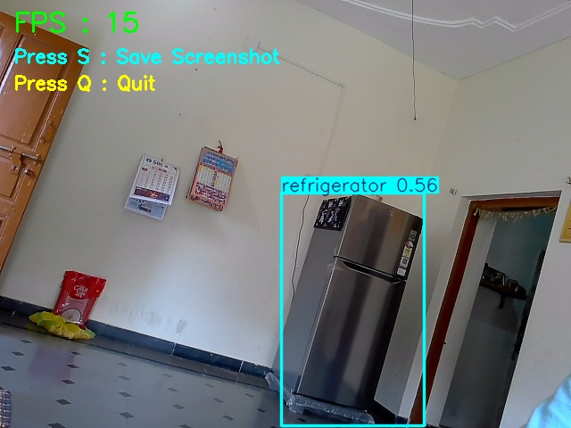

# 🎯 AI Object Detection using YOLOv8

## 📌 Project Overview

This project was developed as part of the **CodeAlpha Artificial Intelligence Internship**.

The application performs **real-time object detection** using the **YOLOv8 (You Only Look Once)** model and **OpenCV**. It captures live video from the webcam, detects multiple objects, draws bounding boxes with confidence scores, and displays the results in real time.

---

## 🚀 Features

- 🎥 Real-time webcam object detection
- 🤖 YOLOv8 pre-trained AI model
- 📦 Detects 80+ object categories
- 🏷️ Displays object labels and confidence scores
- ⚡ FPS (Frames Per Second) display
- 📸 Press **S** to save screenshots
- ❌ Press **Q** to exit the application
- 🖥️ User-friendly interface

---

## 🛠️ Technologies Used

- Python
- OpenCV
- Ultralytics YOLOv8
- NumPy

---

## 📁 Project Structure

```
CodeAlpha_ObjectDetection
│
├── object_detection.py
├── requirements.txt
├── README.md
├── screenshots
│   └── detection_1.jpg
└── output
```

---

## 📦 Installation

Install the required libraries:

```bash
pip install -r requirements.txt
```

---

## ▶️ Run the Project

```bash
python object_detection.py
```

---

## 📸 Sample Output

The application can detect objects such as:

- 👤 Person
- 💻 Laptop
- 📱 Cell Phone
- 🖱️ Mouse
- ⌨️ Keyboard
- 🪑 Chair
- 🍼 Bottle
- ☕ Cup
- 📖 Book

### Screenshot

> Add your screenshot inside the `screenshots` folder with the name:

```
detection_1.jpg
```

Then display it using:

```markdown

```

--

## 🧠 How It Works

1. Opens the webcam using OpenCV.
2. Loads the YOLOv8 pre-trained model.
3. Captures each video frame.
4. Detects objects in real time.
5. Draws bounding boxes and labels.
6. Displays confidence scores and FPS.
7. Saves screenshots when the **S** key is pressed.
8. Closes the application when the **Q** key is pressed.

---

## 📈 Future Enhancements

- 🎥 Video file detection
- 🖼️ Image upload detection
- 📊 Object counting
- 🚶 Multi-object tracking
- 📁 Save detected videos
- 🌐 Web-based interface
- 📱 Mobile application support

---

## 👨‍💻 Author

**Sathish Puppala**

B.Tech Student | Artificial Intelligence Enthusiast

GitHub: https://github.com/puppalasathish2003

---

## 📄 License

This project was developed for educational purposes as part of the **CodeAlpha Artificial Intelligence Internship**.
